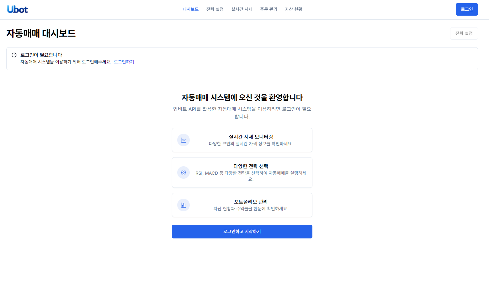
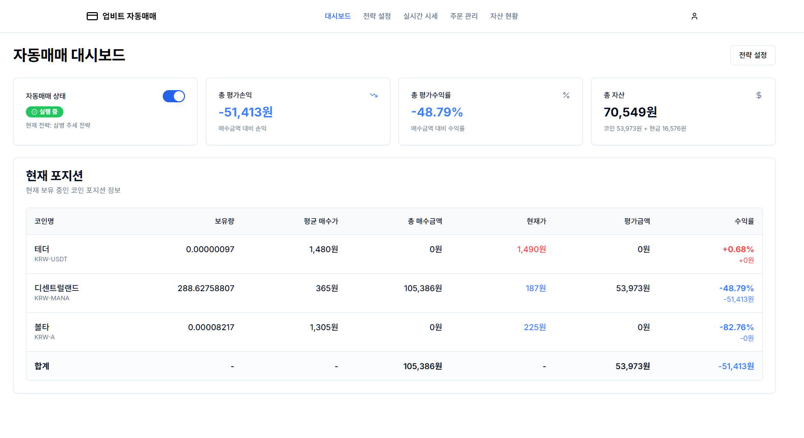
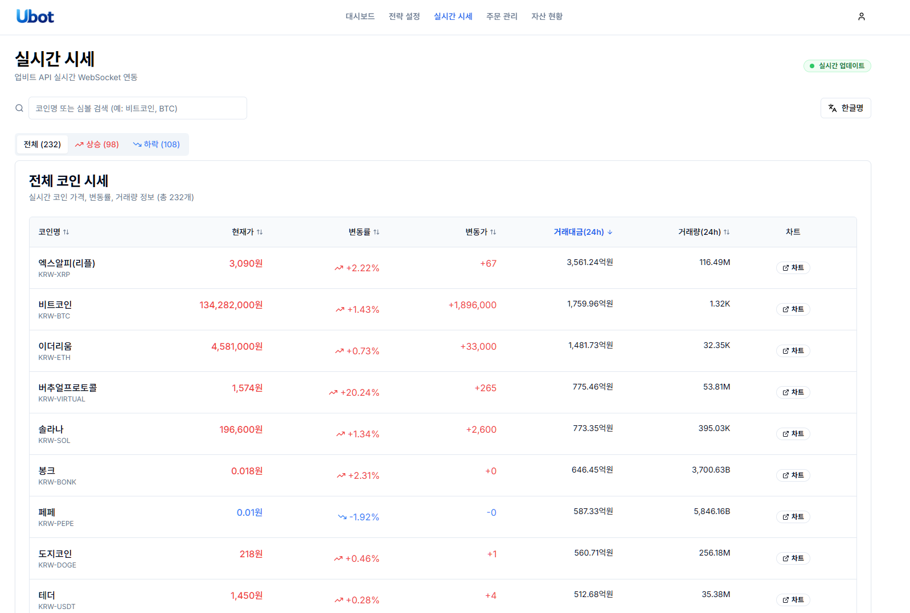
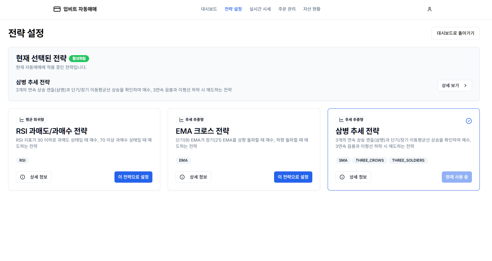
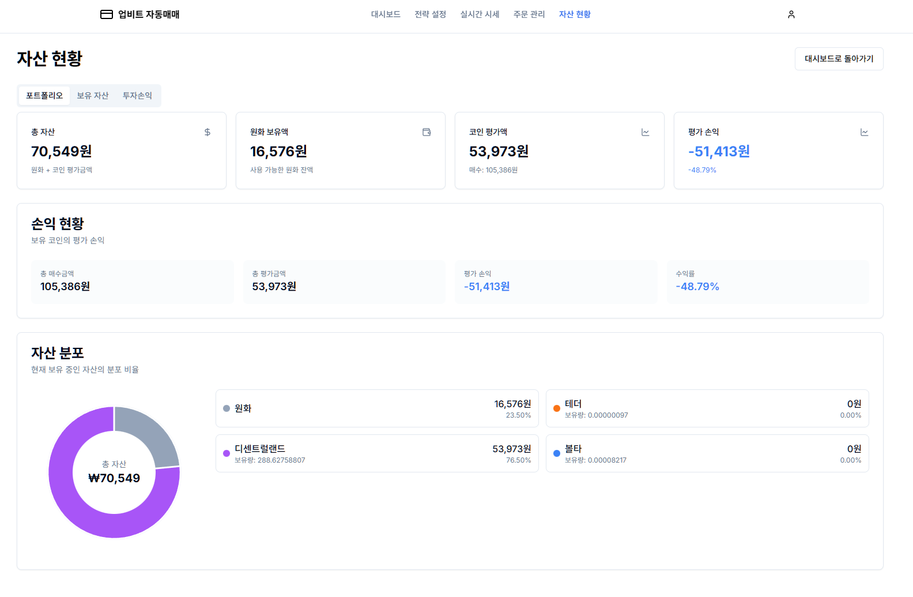
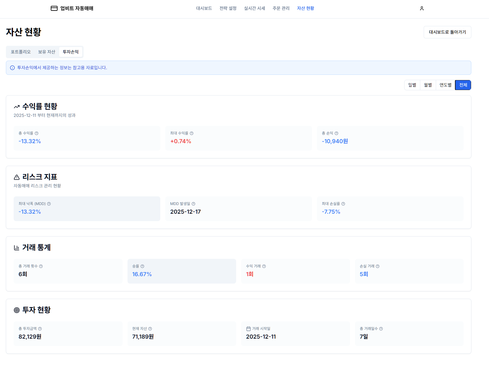
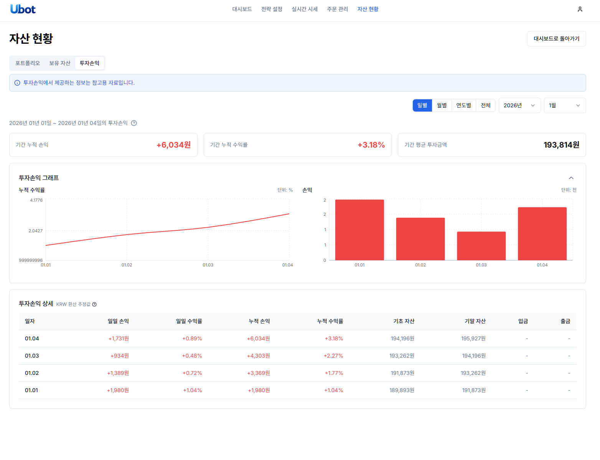
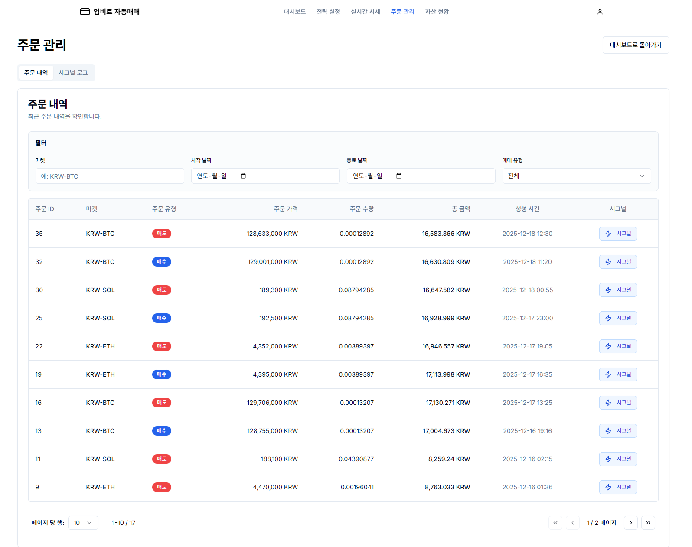
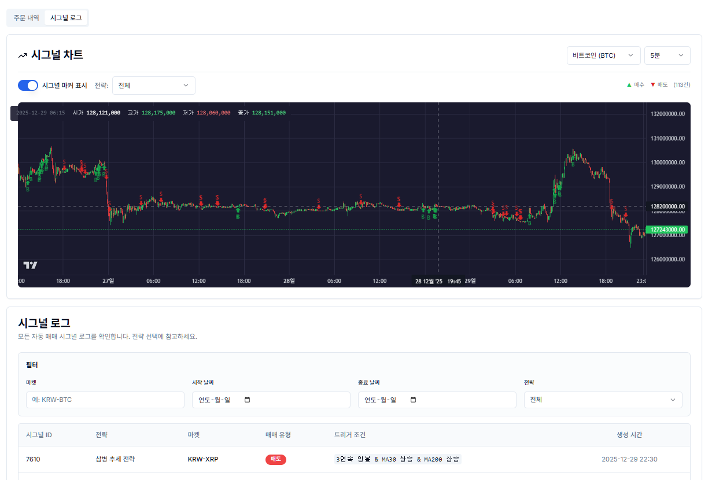
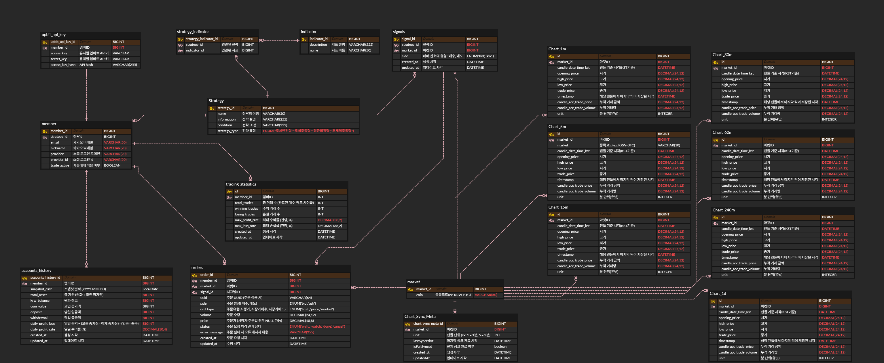

# 🤖 Autric - 업비트 암호화폐 자동매매 시스템

<!-- 목업 이미지 위치 -->


---

# 목차

1. [개요](#개요)
2. [프로젝트 소개](#프로젝트-소개)
3. [시스템 아키텍처](#시스템-아키텍처)
4. [기술 스택](#기술-스택)
5. [주요 기능](#주요-기능)
6. [서비스 화면](#서비스-화면)
7. [자동매매 동작과정](#자동매매-동작과정)
8. [ERD](#erd)
9. [팀원 소개](#팀원-소개)
10. [향후 계획](#향후-계획)

---

# 개요

**Autric**은 업비트 거래소를 대상으로 하는 **암호화폐 자동매매 시스템**입니다.

암호화폐 시장은 24시간 365일 운영되며, 빠른 시세 변동으로 인해 개인 투자자가 최적의 매매 타이밍을 포착하기 어렵습니다. 이러한 문제를 해결하기 위해 **Autric**은 사용자가 설정한 매매 전략에 따라 자동으로 거래를 실행하여, `수동 거래의 피로감 해소`와 `감정적 매매 방지`를 목표로 합니다.


> **개발 기간** : 2025.06 ~ 현재 진행중

---

# 프로젝트 소개

### 📋 서비스명
- **Autric** (Auto + Rich)

### 🎯 서비스 타겟
- 암호화폐 투자에 관심이 있지만 24시간 시장을 모니터링하기 어려운 직장인
- 감정적 매매를 줄이고 규칙 기반 투자를 하고 싶은 트레이더

### 🎵 주요 서비스
| 기능 | 설명 |
|------|------|
| **자동매매** | 사용자가 선택한 전략에 따라 실시간으로 매수/매도 주문 자동 실행 |
| **실시간 시세** | 업비트 WebSocket을 통한 실시간 가격 및 변동률 모니터링 |
| **전략 선택** | Three Soldiers Trend, RSI Threshold, EMA Cross 등 다양한 매매 전략 제공 |
| **포트폴리오** | 보유 자산 현황 및 수익률 확인 |
| **주문 내역** | 자동매매로 체결된 주문 이력 조회 |

---

# 시스템 아키텍처


# 기술 스택

### 💾 Backend


### 🐍 Strategy Server


### 📱 Frontend


### 📨 Infrastructure


### 📡 External API


### ⚙️ Management Tool


### 🖥️ IDE


---

# 주요 기능

### 1️⃣ 실시간 시세 모니터링
- 업비트 WebSocket을 통한 **실시간 가격 업데이트**
- 마켓별 현재가, 변동률, 거래량 표시

### 2️⃣ 자동매매 시스템
- 사용자가 선택한 전략에 따라 **자동 매수/매도 실행**
- 시장가 주문으로 **즉시 체결** 보장
- 쿨다운 시스템으로 **과매매 방지**

### 3️⃣ 매매 전략
| 전략명 | 설명 |
|--------|------|
| **Three Soldiers Trend** | 3연속 양봉/음봉 + MA 필터 기반 추세 추종 전략 |
| **RSI Threshold** | RSI 과매수/과매도 구간 기반 역추세 전략 |
| **EMA Cross** | 단기/장기 EMA 교차 시점 매매 전략 |

### 4️⃣ 포트폴리오 관리
- 업비트 API 연동을 통한 **실시간 자산 현황** 조회
- 보유 코인별 평가금액 및 수익률 확인

### 5️⃣ 주문 내역 조회
- 자동매매로 체결된 **모든 주문 이력** 확인
- 전략별, 마켓별 필터링 기능

---

# 서비스 화면

<details>
<summary><b>📸 서비스 화면 보기 (클릭하여 펼치기)</b></summary>

<br>

### 1. 메인 대시보드

#### 로그인 전


#### 로그인 후


> 카카오 소셜 로그인을 통해 서비스에 접속하고, 자동매매 상태를 한눈에 확인합니다.

---

### 2. 실시간 시세 모니터링



> 업비트 WebSocket을 통해 실시간 시세를 모니터링합니다. 현재가, 변동률, 거래량을 실시간으로 확인할 수 있습니다.

---

### 3. 전략 선택 및 자동매매 설정



> 다양한 매매 전략 중 원하는 전략을 선택하고 자동매매를 활성화합니다.

---

### 4. 포트폴리오

#### 자산 현황


#### 투자 통계


#### 계좌 내역


> 보유 자산 현황, 수익률 통계, 계좌 입출금 내역을 확인합니다.

---

### 5. 주문 내역

#### 주문 로그


#### 시그널 로그


> 자동매매로 생성된 시그널을 차트형태로 확인하며 체결된 주문 이력을 조회합니다.

</details>

---

# 자동매매 동작과정

사용자가 자동매매를 활성화하면, 시스템은 다음 3단계를 거쳐 자동으로 매매를 실행합니다.


## 전체 흐름
```
[1. 데이터 수집]        [2. 시그널 생성]        [3. 주문 실행]
 Backend                Strategy Server         Backend
    │                        │                      │
업비트 API ──▶ Redis ──▶ Kafka ──▶ 전략 분석 ──▶ Kafka ──▶ 주문 실행
    │           │      (price.update)    │      (signal.out)    │
    ▼           ▼                        ▼                      ▼
  캔들 수집   캐싱 저장              BUY/SELL 판단          업비트 주문 API
```


## Step 1. 데이터 수집

Backend 서버가 주기적으로 업비트 API를 호출하여 캔들 데이터를 수집합니다.
```
[업비트 REST API]
        │
        ▼
[Backend: ChartSyncService]
        │
        ├── 캔들 데이터 Redis 저장 (최근 1000개)
        │
        └── Kafka로 업데이트 알림 발행 (price.update 토픽)
```

| 항목 | 내용 |
|------|------|
| 수집 주기 | 1분마다 |
| 수집 대상 | 1분 / 5분 / 30분 / 60분 / 240분 / 일봉 |
| 저장소 | Redis (실시간 조회용) |


## Step 2. 시그널 생성

Strategy Server가 Kafka 메시지를 수신하면, Redis에서 캔들 데이터를 조회하여 매매 시그널을 생성합니다.
```
[Kafka: price.update 수신]
        │
        ▼
[Redis에서 캔들 데이터 로드]
        │
        ▼
[전략별 evaluate() 실행]
├── Three Soldiers Trend
├── RSI Threshold
└── EMA Cross
        │
        ▼
[판단 결과]
├── BUY  → Kafka(signal.out) 발행
├── SELL → Kafka(signal.out) 발행
└── HOLD → 무시 (발행 안 함)
```

### Three Soldiers Trend 전략 예시
```python
# 매수 조건
buy_signal = (
    three_white_soldiers and    # 3연속 양봉 패턴
    ma30 상승 중 and            # 단기 이동평균 상승
    ma200 상승 중 and           # 장기 이동평균 상승
    쿨다운 통과                  # 과매매 방지
)

# 매도 조건
sell_signal = (
    three_black_crows and       # 3연속 음봉 패턴
    ma30 하락 중 and            # 단기 이동평균 하락
    ma200 하락 중 and           # 장기 이동평균 하락
    쿨다운 통과
)
```


## Step 3. 주문 실행

Backend 서버가 시그널을 수신하면, 해당 전략을 구독 중인 회원들의 주문을 실행합니다.
```
[Kafka: signal.out 수신]
        │
        ▼
[전략 구독자 조회]
(tradeActive=true, strategyId 일치)
        │
        ▼
[회원별 주문 실행]
        │
        ├── 1. 업비트 계좌 잔고 조회
        ├── 2. 주문 수량 계산
        ├── 3. 시장가 주문 실행
        └── 4. 주문 결과 DB 저장
```

### 주문 실행 조건

| 조건 | 내용 |
|------|------|
| 최소 주문 금액 | 5,000원 이상 |
| 주문 방식 | 시장가 (즉시 체결) |
| 잔고 확인 | 매수 시 KRW 잔고, 매도 시 코인 잔고 확인 |
| 수수료 | 0.05% 고려하여 주문 금액 계산 |


## 시그널 발생부터 체결까지 예시
```
10:05:01  [Backend]  KRW-BTC 5분봉 캔들 업데이트 완료
10:05:01  [Backend]  Kafka(price.update) 발행: KRW-BTC
10:05:02  [FastAPI]  price.update 수신 → 전략 분석 시작
10:05:02  [FastAPI]  Three Soldiers 매수 조건 충족 → BUY 시그널
10:05:02  [FastAPI]  Kafka(signal.out) 발행: KRW-BTC, BUY
10:05:03  [Backend]  signal.out 수신 → 구독자 3명 조회
10:05:03  [Backend]  회원1: 잔고 100,000원 → 99,950원 매수 주문
10:05:03  [Backend]  회원2: 잔고 50,000원 → 49,975원 매수 주문
10:05:03  [Backend]  회원3: 잔고 3,000원 → 최소 금액 미달, 스킵
10:05:04  [Upbit]    주문 체결 완료
10:05:04  [Backend]  Orders 테이블에 주문 결과 저장
```

---

# ERD

<!-- ERD 이미지 위치 -->


### 주요 엔티티

| 엔티티 | 설명 | 주요 필드 |
|--------|------|-----------|
| `Member` | 회원 정보 | id, email, tradeActive, strategy |
| `Strategy` | 매매 전략 | id, name, description, indicators |
| `Signals` | 매매 시그널 | id, strategy, market, side, createdAt |
| `Orders` | 주문 내역 | id, member, market, signal, uuid, side, volume, price, status |
| `Market` | 마켓 정보 | id, coin (예: KRW-BTC) |
| `ChartSyncMeta` | 차트 동기화 메타 | market, unit, lastSyncedAt, isFullSynced |

---

# 팀원 소개

### 👨‍👨‍👦 팀 구성

| 이름                    | 역할                         | 담당 기술                                        |
|-----------------------|----------------------------|----------------------------------------------|
| **한성현**               | Backend & Strategy | Spring Boot, FastAPI, Redis, Kafka |
| **정인상**               | Backend & Infra | Spring Boot, Kafka, CI/CD                    |

---

### 🛠️ 개발 방식

| 영역 | 방식                                                             |
|------|----------------------------------------------------------------|
| **Backend** | 팀원 2명이 설계부터 배포까지 전담                                            |
| **Frontend** | Claude 기반 AI-assisted 개발로 UI를 생성·구성하고, 팀이 요구사항 정의, API 연동 등 진행 |

---

### 🔥 역할 상세

**한성현**
- Spring Boot 백엔드 API 설계/구현
- FastAPI 전략 서버 설계 및 구현
- Frontend 화면 흐름 정의 및 백엔드 연동 검증

**정인상**
- Spring Boot 백엔드 API 설계/구현
- OAuth2 인증/인가 구현
- Docker 기반 CI/CD 파이프라인 구성
- Frontend 배포 환경 구성


---

# 프로젝트 구조

```
upbit-auto-trading/
├── backend/                    # Java Spring Boot 백엔드
│   └── src/main/java/com/autric/upbit/
│       ├── domain/
│       │   ├── account/        # 계좌 관리
│       │   ├── chart/          # 차트 데이터 동기화
│       │   ├── member/         # 회원 관리
│       │   ├── oauth/          # OAuth2 인증
│       │   ├── order/          # 주문 관리
│       │   ├── signal/         # 시그널 관리
│       │   └── strategy/       # 전략 관리
│       ├── external/
│       │   ├── kafka/          # Kafka Consumer/Producer
│       │   └── upbit/          # 업비트 API 클라이언트
│       └── global/             # 공통 설정, 보안
│
├── frontend/                   # Next.js 프론트엔드
│   ├── app/                    # App Router (페이지)
│   │   ├── market/             # 시장 현황
│   │   ├── mypage/             # 마이페이지
│   │   ├── orders/             # 주문 내역
│   │   ├── portfolio/          # 포트폴리오
│   │   └── strategies/         # 전략 선택
│   ├── components/             # UI 컴포넌트
│   ├── hooks/                  # React Query 훅
│   └── stores/                 # Zustand 스토어
│
├── strategy_fastapi/           # Python FastAPI 전략 서버
│   └── app/
│       ├── messaging/          # Kafka Consumer/Producer
│       ├── repositories/       # Redis 데이터 조회
│       ├── services/           # 비즈니스 로직
│       └── strategies/         # 매매 전략 구현체
│
└── docker-compose.yml          # 서비스 오케스트레이션
```

---


